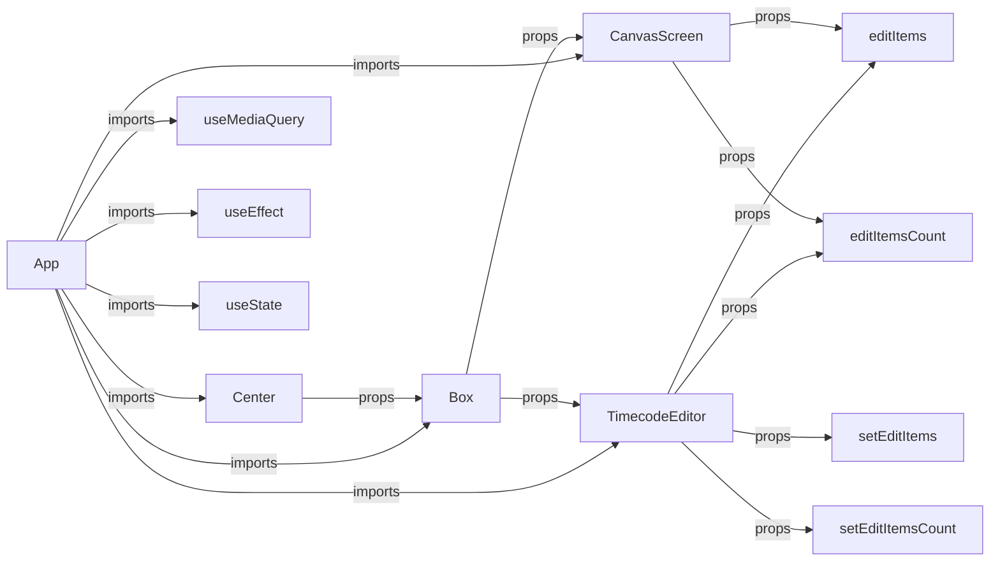

# simple-slideshow-editor

simple-slideshow-editorはReactベースのシンプルなスライドショーエディターです。 

---

## 概要

このプロジェクトは、スライドショーエディターを作成することを目的としています。デスクトップ画面での編集が主なユースケースです。画像を選び、時間軸上にセットし、シーケンスの再生、エクスポートを行うことができます。

### ディレクトリ構成

```
simple-slideshow-editor
    ├── README.md
    ├── package-lock.json
    ├── package.json
    ├── public
    │   ├── favicon.ico
    │   ├── images
    │   ├── index.html
    │   ├── logo192.png
    │   ├── logo512.png
    │   ├── manifest.json
    │   └── robots.txt
    ├── src
    │   ├── App.css
    │   ├── App.tsx
    │   ├── components
    │   |   ├── CanvasScreen.tsx
    │   |   ├── EditItem.tsx
    │   |   ├── ExportModal.tsx
    │   |   └── TimecodeEditor.tsx
    │   ├── index.css
    │   └── index.tsx
    └── tsconfig.json
```

### 使用方法

1. 画像を追加します。左側のウインドウで、追加したい画像を選びます。
2. 追加した画像は、時間軸上に表示されます。画像を時間軸にドラッグ＆ドロップすることができます。また、画像を削除する場合は画像を右クリックして、Deleteキーを押します。
3. キャンバス画面の下部には再生、停止、ポーズ、ループのコントロールボタンがあります。スライドショーの再生を行いたい画像を選択し、再生ボタンをクリックします。
4. 編集したスライドショーをエクスポートする場合は、エクスポートボタンをクリックしてください。

※ ユーザーが使用できるファイル形式は.mp4のみです。

### ライブラリ

simple-slideshow-editorは以下のライブラリを使用しています。

- @chakra-ui/react
- React
- TypeScript

---

## Configuration Diagram

